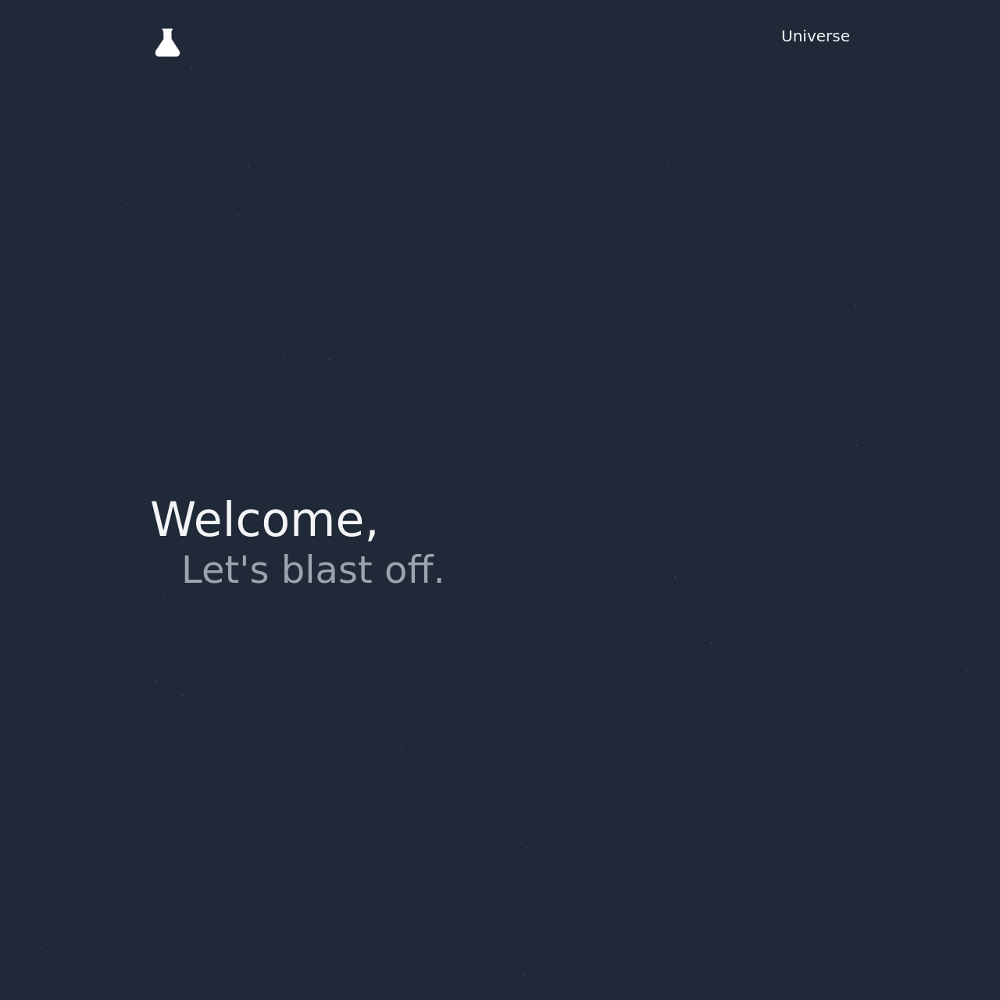

# blazed-parking

Blazed Standard Parking Page

## Demo
- [Live demo 1](https://blazed.sbs/)
- [Live demo 2](https://blazed.monster/)

## Running Locally
This page is delivered as a static HTML file. To run, simply double click "index.html".

## How was this made?
The parking page uses the following libraries:
- Tailwind 2.0
- Stars Background
    + Source: https://tailwindcomponents.com/component/landing-page-with-twinkling-stars
    + Landing Page With Twinkling Stars by Icesofty [https://github.com/Icesofty]
- JQuery v.2.2.4

## Credits
- [Tyler Ruff](https://github.com/tyler-ruff)
- [Blazed Labs LLC](https://blazedlabs.com)
- [Blazed Systems BD.](https://blazed.systems/)
- [Blazed Publishing BD.](https://blazed.xyz/)
- <3 Love to:
- [Blazed City](https://blazed.city/), 
- [Blazed World](https://blazed.world/)
- All Blazed & [RUFF Foundation](https://blz.one/) Contributors
